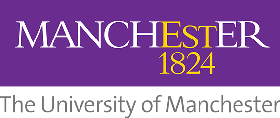

## Neural-symbolic Knwoledge Representation and Reasoning

5-day (90 mins per day) lecture of 2nd European Summer School on Artificial Intelligence ([ESSAI 2024](https://essai2024.di.uoa.gr/)), Athens, Greece, 15-16 July 2024.

Lecturers: [Uli Sattler](http://www.cs.man.ac.uk/~sattler/) & [Jiaoyan Chen](https://chenjiaoyan.github.io/) 

#### Contents

| Day    | Topic | Concepts | Techniques | 
| --------- | ------- | --------- | ------- | 
| 1     |    Knowledge Graph     | parsing/serialisation, queries, schemas, validation & reasoning | RDF(S), SPARQL, SHACL| 
| 2     |    Ontologies     | Facts & background knowledge, entailments, reasoning & materialisation| OWL, OWL API, Owlready, Protégé | 
| 3     |    Knowledge Graph Embeddings    | Classis Es, variants, inductive inference, literal-aware Es, incremental Es, application| TransE, TransH, TransR, GCN, R-GCN, OntoZSL, RMPI| 
| 4     |    Ontology Embeddings     | Geometric embeddings, literal-aware OEs, faithfulness, evaluation & applications |ELEm, Box2EL, OWL2Vec*, LogMap-ML, ZSL, mOWL| 
| 5     |    Language Models & KR, Discussion & Outlook     | LM for KR, ontology & KG for LLM| BERTMap, BERTSubs, DeepOnto, ICON, BLINKOut, GraphRAG | 

### Slides
[Day 1](https://github.com/ChenJiaoyan/teaching/blob/main/uom/nskrr-day1.pdf), [Day 2](https://github.com/ChenJiaoyan/teaching/blob/main/uom/nskrr-day2.pdf), [Day 3](https://github.com/ChenJiaoyan/teaching/blob/main/uom/nskrr-day3.pdf), [Day 4](https://github.com/ChenJiaoyan/teaching/blob/main/uom/nskrr-day4.pdf), [Day 5](https://github.com/ChenJiaoyan/teaching/blob/main/uom/nskrr-day5.pdf)

---

   [The University of Manchester](https://www.manchester.ac.uk/)
